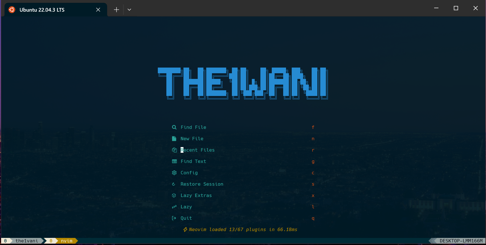
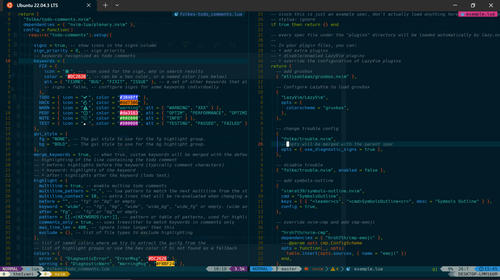

<h1>The1wani's dotfiles</h1>
Warning: Watch Tutorials on Youtube before cloning.

<h1>Contents</h1>

1. Neovim Config
2. Tmux Config
3. Fish Config

<h1>Neovim Setup</h1>

<h3>Requirements</h3>

1. Neovim >= 0.9.0 (needs to be built with LuaJIT)
2. Git >= 2.19.0 (for partial clones support)
3. [Lazyvim](https://www.lazyvim.org/)
4. A [Nerd Font](https://www.nerdfonts.com/)
5. A **C** Compiler for nvim-treesitter to install.
6. For [Telescope.nvim](https://github.com/nvim-telescope/telescope.nvim) (optional).
   - live grep: [ripgrep](https://github.com/BurntSushi/ripgrep)
   - find files: [fd](https://github.com/sharkdp/fd)
7. WSL (Windows Subsystem for Linux)
8. A Terminal that supports true color
   - [Windows Terminal](https://www.microsoft.com/store/productId/9N0DX20HK701?ocid=pdpshare)
9. [Homebrew](https://brew.sh/) (Package Manager for Linux)

<h1>Shell Setup</h1>

1. [Fish shell](https://fishshell.com/)
2. [Fisher](https://github.com/jorgebucaran/fisher) - (Plugin Manager for Fish Shell)
3. [Tide](https://github.com/IlanCosman/tide) - (Shell Theme)
4. [Nerd Fonts](https://www.nerdfonts.com/) - (I use **Hack Fonts**)
5. [z for fish](https://www.nerdfonts.com/) - (Directory Jumper)
6. [Eza](https://github.com/eza-community/eza) - (**ls** Replacement)
7. [fzf](https://github.com/PatrickF1/fzf.fish) - (Interactive Filtering)
